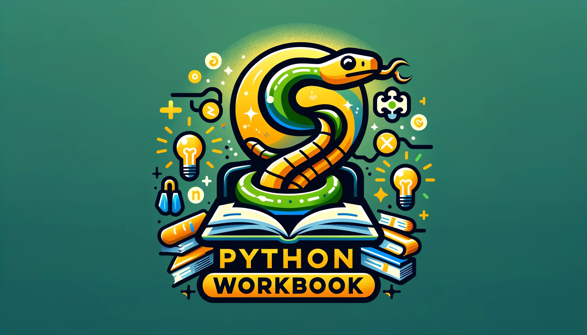

# Python Workbook

Este es el repositorio oficial del curso de Python Workbook que actualmente se encuentra en Udemy y Youtube.

## Puesta en marcha (PyCharm)
Esto es un proyecto en [PyCharm](https://www.jetbrains.com/es-es/pycharm/download/), un IDE gratuito y sencillo de usar. Simplemente puedes clonar este repositorio y abrirlo en el editor. Luego debes entrar a algún script que quieras correr, y darle al botón Run.

## Puesta en marcha (VSC)
Ahora también se preparó para [Visual Studio Code](https://code.visualstudio.com/). Para instalarlo debes seguir los siguientes pasos:

Clonar el Proyecto; y una vez dentro, crear y activar el entorno virtual:

> python -m venv venv

> .\venv\Scripts\activate

Instalar las dependencias

> pip install -r requirements.txt

## Proyectos
- [El famoso juego "Piedra, Papel o Tijeras"](projects/rock_paper_scissors.py)
- [Cuenta la cantidad de palabras que tiene un string](projects/count_words.py)
- [Juego de dados](projects/dice_game.py)
- [Juego de Ahorcado](projects/hangman.py)
- [Lee una frase de la consola y la censura](projects/bad_word_detector.py)
- [Calculadora Simple](projects/calculator.py)

## Otros recursos útiles
A continuación, te comparto otros links que te pueden resultar elementales para continuar tu camino en el desarrollo de software:
- [En Código Podcast](https://podcasters.spotify.com/pod/show/maxi-burgos9): Un podcast donde hablo de desarrollo, especialmente en Python.
- [Desarrollo web con Python y Django](https://www.udemy.com/course/desarrollo-de-sitios-web-con-python-3-con-django/?referralCode=A491B0944C634BFAA48C) [[DEMO](https://www.youtube.com/playlist?list=PLp7PPjAxisAICL8_g0lmC3thJvHW5Hbe3)]
- [Python Practices](https://github.com/maxwellnewage/python-practices): Repositorio de prácticas en Python con más de 100 ejemplos y proyectos distintos, listos para clonar y correr.
- [Curso de Git desde cero](https://www.udemy.com/course/aprende-a-dominar-git-de-cero-a-experto/): Curso gratuito en Udemy con una valoración de 4.5 estrellas.